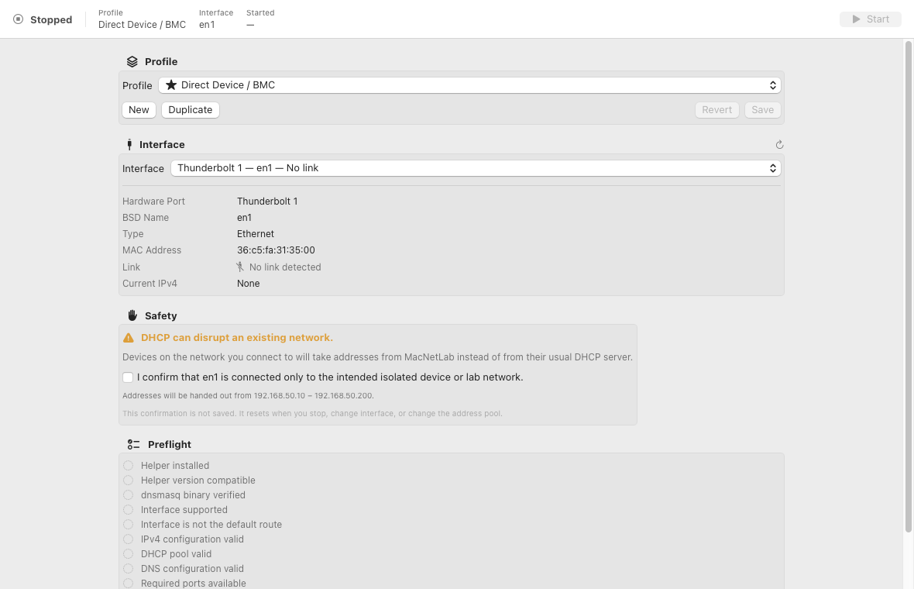
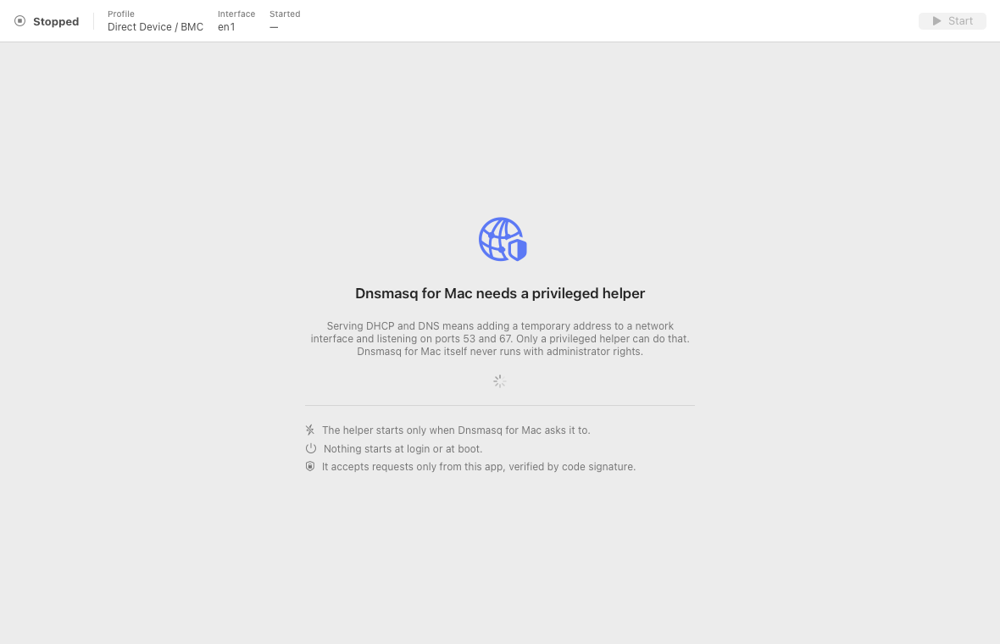
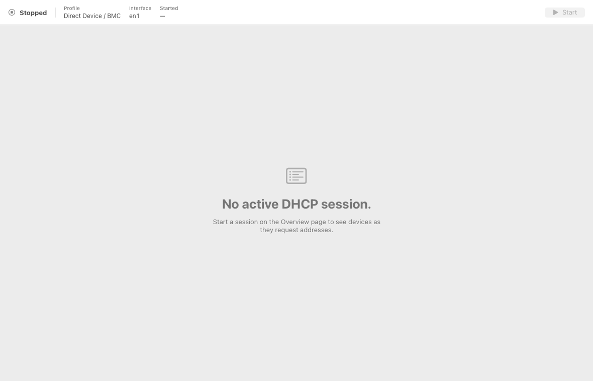
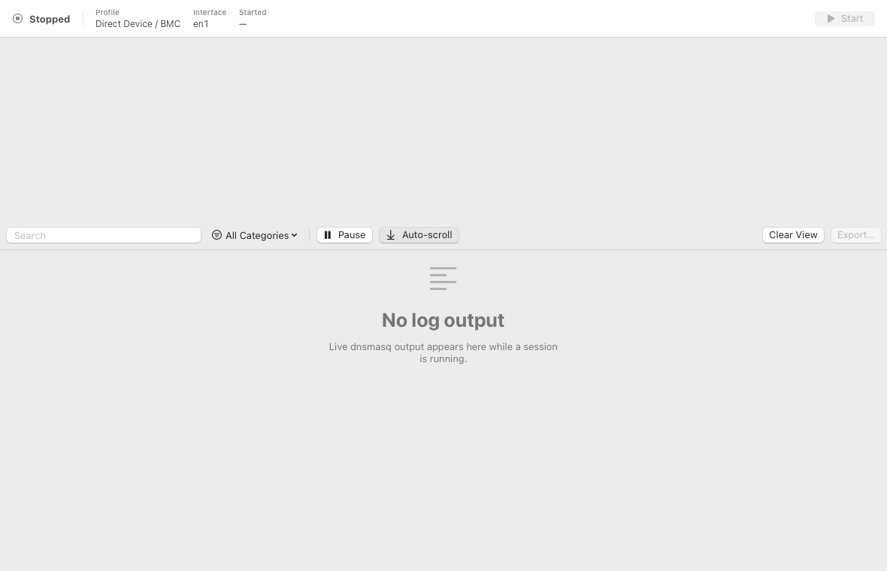
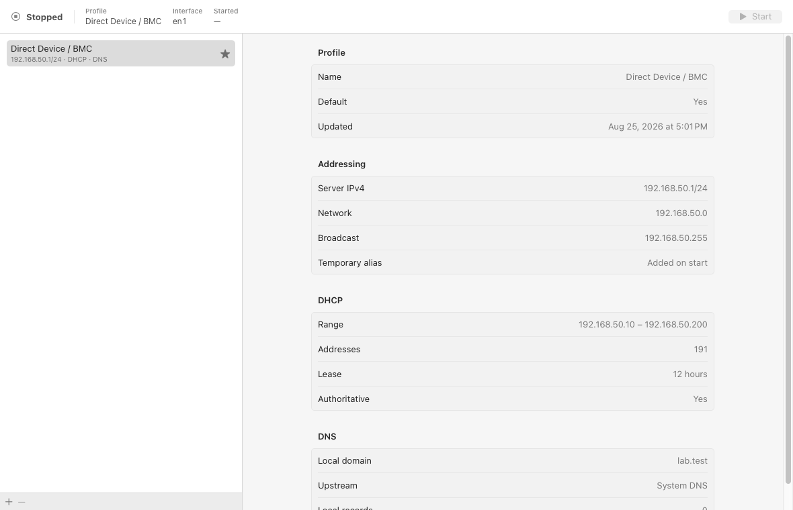
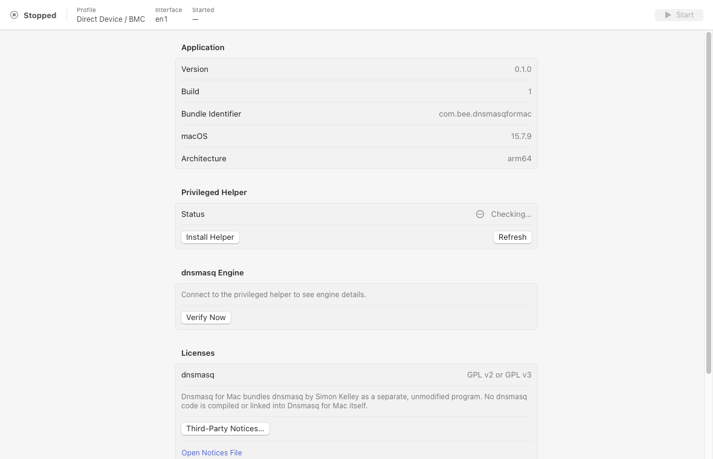
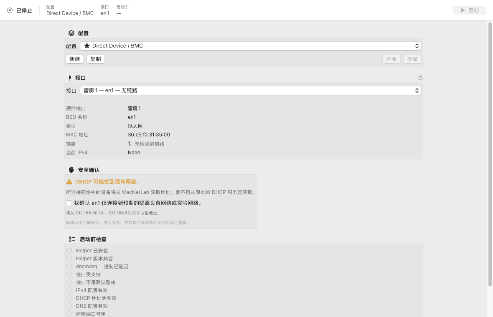

<div align="center">

# Dnsmasq for Mac

**A GUI for dnsmasq on macOS — DHCP and DNS for a lab network, without the terminal.**


**English** · [简体中文](README.zh-CN.md) · [日本語](README.ja.md)



</div>

---

## Why this exists

Apple's own Server app used to do this. The service was dropped years before the app itself
was discontinued in 2022, and nothing replaced it.

So: you walk into a datacenter with a MacBook and a USB-to-Ethernet adapter, and you want to
hand a temporary address to a BMC or a switch management port. On macOS that means a terminal,
`ifconfig`, a hand-written `dnsmasq.conf`, a pile of `sudo`, and remembering to clean it all up
afterwards.

This app makes that a window: pick an interface, pick a profile, press Start.

## What it does

- Adds a **temporary** IPv4 address to a chosen wired interface, and removes it on stop
- Single-subnet DHCPv4 with a configurable pool, lease duration, and router / DNS options
- DNS forwarding (system, custom, or local-records-only), local A records, and a local domain
  such as `lab.test`
- Live leases and live logs, filtered by DHCP / DNS / warning / error, exportable as text
- Reusable profiles

## What it deliberately does not do

It never touches `/etc/hosts` or `/etc/dnsmasq.conf`, and never makes a permanent change to any
macOS network service. No telemetry, no log upload, no network calls at runtime. Nothing starts
automatically.

Wi-Fi and whichever interface currently carries your internet connection are **barred** from
DHCP — enforced in the privileged helper, not merely greyed out in the UI.

## Screenshots

<table>
<tr>
<td width="50%"></td>
<td width="50%"></td>
</tr>
<tr>
<td align="center"><b>Helper installation</b></td>
<td align="center"><b>Leases</b></td>
</tr>
<tr>
<td width="50%"></td>
<td width="50%"></td>
</tr>
<tr>
<td align="center"><b>Logs</b></td>
<td align="center"><b>Profiles</b></td>
</tr>
<tr>
<td width="50%"></td>
<td width="50%"></td>
</tr>
<tr>
<td align="center"><b>Settings</b></td>
<td align="center"><b>Simplified Chinese interface</b></td>
</tr>
</table>

The interface is localized into English and Simplified Chinese, and follows your system
language. Regenerate every shot, in every shipped language, with `make screenshots`.

## Building

Needs macOS 14+ and Xcode 26+.

```bash
make bootstrap        # install dev tooling, generate the Xcode project
make vendor-dnsmasq   # fetch and build dnsmasq 2.93 as Universal 2
make build
make test
```

`DEVELOPMENT_TEAM` in `Config/Identifiers.xcconfig` is my Team ID; **replace it with yours** or
codesign will refuse. Every identifier in the project lives in that one file.

`DnsmasqForMac.xcodeproj` is generated and not committed — `project.yml` is the source of truth.

## Status

It builds, and 278 automated tests pass. Some things I **could not verify**:

- No Developer ID certificate here, so signed distribution and notarization are untested —
  which is why there is no download yet, only source
- Registering the privileged helper needs a human to approve it in System Settings, so the
  end-to-end XPC round trip has not been exercised
- Real DHCP/DNS traffic needs real hardware; [`Docs/MANUAL_TEST_PLAN.md`](Docs/MANUAL_TEST_PLAN.md)
  has the manual steps

All of it is recorded in [`Docs/RISKS.md`](Docs/RISKS.md) rather than presented as passing.

## About dnsmasq

The bundled dnsmasq is a **separate, unmodified executable**, driven through a configuration file
and process management. No dnsmasq source or object code is compiled or linked into any binary in
this project. dnsmasq is by Simon Kelley, licensed GPL v2 or v3; both licence texts ship inside
the app bundle, and every release is packaged with the corresponding source.

This project's own licence is not yet decided (`LICENSE_PENDING`) and needs a legal review before
any real distribution.

## Documentation

| | |
|---|---|
| [`Docs/ARCHITECTURE.md`](Docs/ARCHITECTURE.md) | How the app, the privileged helper, and dnsmasq fit together |
| [`Docs/SECURITY.md`](Docs/SECURITY.md) | Trust boundaries, and what is deliberately not defended |
| [`Docs/PRIVILEGED_HELPER.md`](Docs/PRIVILEGED_HELPER.md) | Installing, approving, repairing, removing the helper |
| [`Docs/DNSMASQ_BUILD.md`](Docs/DNSMASQ_BUILD.md) | How the bundled dnsmasq is fetched, verified, and built |
| [`Docs/RISKS.md`](Docs/RISKS.md) | Everything known to be unsettled |
| [`Docs/MANUAL_TEST_PLAN.md`](Docs/MANUAL_TEST_PLAN.md) | The tests that need real hardware |
| [`CONTRIBUTING.md`](CONTRIBUTING.md) | The rules a patch has to hold to, and why they exist |
